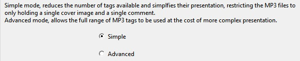

========
Usage
========

From commandline::

    Usage: python3 Pub2SDwizard.py
    
From desktop (Windows 64bit binary), double-click on the Pub2SDwizard icon.

.. image:: images/mainc.png
   :width: 57
   :alt: Pub2SDwizard icon

Which interface language?
------------------------------
Your first choice is which interface language you wish to work with. 
The gui interface language can be selected from the drop-down list at the top right of the screen and can be changed at any time.

Next Pub2SDwizard starts by asking three questions:

The name of your project?
------------------------------

.. image:: images/project_name.jpg
   :width: 766
   :alt: Project name

This can either be entered directly or chosen from the drop-down list. 
The project settings can be saved at any time and will be held in a '<project name>.prj' file stored in a 
'Pub2SD' folder under your home folder (i.e. 'C:\Users\<username>\Pub2SD'). 
This project name will also be used as the name of the top level folder on the SD card which will hold your published files.

The type of your project?
-----------------------------

The type of project can be changed later. If you start with a
'Advanced' project and later want to convert it to a 'Simple' project,
any of the tags which are only available in 'Advanced' mode will be
removed and their data lost.

A simple project will only allow you to use tags which can be
presented as simple strings and restricts you to a single piece of
artwork and a single comment whose language is not defined.

A number of the 'advanced' tags allow you to have multiple entries
for each tag distiguished by theit 'language' and 'desciption' fields.
In addition there are many different types of artwork that can be
included. Though not all applications may recognise these features.

Once you've chosen your project name and select your project type,
you can click on the 'Next' button. This will update the 'Current
project:' and 'Mode:' fields near the top of the window. However you
may wish to select some
additional items from the 'Optional' section first.

Optional extras?
-------------------

These features can be ignored if you are happy to accept the default
settings.

*Which template?*

When you first run the program the there won't be any templates
listed and so you can ignore this choice and receive a default set of
tags pre-selected for you. Later once you have created one or more
templates you will be able select the one you wish to attach to this
project. On new projects this will determine which tags will be shown
as pre-selected on the 'Choose MP3 tags' tab. However with an existing
project any new tags specified by the template will be added to the
list of tags selected for modification and display. This will never
remove any tags already present in the project.

Once you have created some templates you can manually edit the
'.json' template files, in your '\\Documents\\Pub2SD' folder, to add
'default values' to some or all of the tags listed by their four
character tag codes. Then whenever an MP3 file is loaded into a project
which has that template attached these default values will be
pre-loaded into Pub2SDwizard for any tags which are blank. No existing
tag data will be overwritten by this mechanism. 

*What prefix?*

.. image:: images/InitialDigit.jpg
   :width: 608

Pub2SDwizard will generate unique names for every collection and MP3
file which will be combined with their filename/Title to ensure they
can be referenced unambiguosly. You may specify a prefix which will be
added to the start of all the
unique names generated for files and collections. This prefix will not
be checked by Pub2SDwizard so ensure that it's characters are
acceptable in filenames for the intended device(s) and keep it short.

Choose MP3 tags
--------------------

.. image:: images/ChooseMP3tags.jpg
   :width: 596

On new projects, the tags specified by your template or in it's
abscence the most commonly used tags are selected by default. In
existing projects the tags already chosen along with any new tags
specified in your template are selected by default. You can add to
or remove tags from the selection with a 'Ctrl+click' on the tag
of interest. You can restore a default selection ofmost commonly used
tags by clicking
on the 'Default tags' button.

Note that only the selected tags will be modified or present in the
final MP3 files. (N.B. Tags with blank values will not be
applied.)

If you are loading an existing project you can add and remove tags
at this stage. The contents of any tags which are removed will be
discarded. Any new tags will be blank.

You can create a new template holding the tags currently selected by
clicking on the 'Save template' button and supplying a descriptive name
when it is requested.

Click on the 'Next' button to proceed.

Special characters</h2>

By default, tags which require 'Latin1' and the filenames generated
are aggressively normalised to remove any special characters to
guarantee compatibility, any punctuation characters or spaces will be
replaced with underscores. You can override this by specifying any
preferences you have. Your preferences will be saved in the project,
but only have effect if the 'Preferred:...' option is chosen. You can
also save your preferences as a separate '.csv' file as examples for
other projects. A 'Latin1' example (which would allow some acented
characters etc... and still be compatible with most devices) is
always availble from the dropdown list. Other examples will be added to
this list as you save them.

Clicking on the blank line in the drop down list will clear the list
of preferences. Clicking on 'Latin1' or any other examples you've saved
will append them to your list of preferences. 

To get the basic 'Latin1' set, select 'Preferred' on the 'Special
characters' tab and select 'Latin1' from the pull-down list on the
right. You should now see a list of character pairs, in this case
telling Pub2SDwizard to retain them since both members of each pair are
identical. If you wanted to replace say '~' with '-' rather than
underscore you'd add ', ~/-' to the end of the list. You could even
override what happens to spaces or commas by using 0xNNNN notation for
their Unicode values. So 0x0020/0x0020 would retain the spaces, while
0x0027/0xA78C would replace the apostrophe with the lower case
saltillo. (Though I don't know how many phones would actually display
it!).

The preferred list is strictly a set of pairs of strings rather than
characters so 'Ŋ/Ng', 'ng/ŋ'
or even 'Tom/Fred' would work. The characters in the strings on either
side of the '/' can either be entered directly or as their Unicode
values using the 0xNNNN notation.

Edit...
-------

The project will be shown as the top level collection, this can't be
moved or deleted.

*Import hierarchy*

In 'Simple' mode only the 'Import a Folder and it's Contents'
button is
enabled. This will select the folder you specify and create a
collection of the same name. Then it will import all MP3 files from
that folder
into the collection, creating sub-collections for any sub-folders and
importing their files to them. Only the MP3 files and the sub-folders
will be imported, any other files will be ignored.

While your project will normally reflect the folder structure
holding your source MP3 files in, 'Advanced' mode allows you to add
collections and files arbitarily. Note if
you wish to add a file you must first select the row holding the
collection you wish to add it to.

The software will try to list the collections and files in a logical
order, BUT you must always verify that the order in which the files are
displayed is
the order you wish them to be played in, adjusting it as necessary.
Note that the title for any collections will be based on the folder
name it derived from rather than the title tag in an MP3 file. So
any compromises made in representing the orthography for the original
operating system will be preserved. Consequently you must always verify
that the titles of the collections are as you wish them to appear(e.g
Saa+ï needs replacing with either Saang or Saaŋ). 

.. image:: images/showFilesPretrim.jpg
   :width: 728

Once you have imported the files and arranged them in the order you
wish, you are recommended to save the project. On restarting the
program
and selecting the project all your existing settings and hierarchy will
be restored. Additional files may be added to the project.

Trim from Title

Based on the order files are displayed Pub2SDwizard will create and
maintain unique
names for each file and use these when the files are published with the
MP3 title (or original filename) appended. Individual files have often
had leading or trailing characters added to
their
filenames (and/or their MP3 titles) to help determine the sequence in
which they should be played. These may no longer be required and so can
be removed using the 'Trim from Title' button. This will also show, in
the left most column, the final folder and file names which will be
published to the SD card.

This will trim characters from every item below the currently
selected
collection. Care must be taken, if no collection is selected the action
will be applied to ALL. In the case of errors, it is often quicker
to abandon a project and start over (loading your saved copy of the
project), rather than trying to correct each
title individually. 

Once you've imported all the files and verified the order in which
they are displayed and trimed any unwanted charaters, click on the
'Next' button.

*Edit Hierarchy*

'Simple' mode will only allow you to delete unwanted files or
collections. 'Advanced' mode allows you to restructure your hierarchy
as well.

Select rows as necessary to either delete items or change their
position in the hierarchy. When you import a folder, only the MP3 files
will be listed but all sub-folders will be shown as collections whether
they contain MP3 files or not.

Once any spurious collections have been removed and the hierarchy
adjusted as you wish click on the 'Next' button. 

*Edit MP3 tags*

.. image:: images/EditTag.jpg
   :width: 604

Internally all text is held as unicode strings and will
be written to the MP3 tags in the final files in 'utf-8' encoding. Tags
which require 'Latin1' encoding will be automatically forced to a
7-ASCII sub-set of
'utf-8', or your preferred mapping. So while titles (TIT2) will be held
and written as unicode
characters, when Pub2SDwizard creates the filename which will be
written to the SD cards all characters will be reduced to their base
forms, diacritics removed, ligatures split and an approximate
transliteration of any cyrillic, greek or non-roman characters will be
attempted. In addition any punctuation or spaces will become underscore
charaters, or your preferred characters. 

( e.g. 'à Â Þ Æ ç Ŋ ŋ ñ ƴ' would become 'a_A_Th_AE_c_NG_ng_n_y')

In 'Simple' mode all tags will be represented as single strings of
characters and their encoding and any other parameters will be hidden.
Indeed only tags which can be treated in this way are available in
'Simple' mode.

In 'Advanced' mode the tags are shown as lists of parameters. The
'encoding' for text read from an MP3 tag will be shown as a
single digit. Whatever the original encoding, the text will always be
written in 'utf-8' represented by '3'. While text strings are typically
held as a list of strings rather than a single string, what is
displayed for any given tag depends on the users MP3 reader
application. In general only the first string in the list is likely to
be displayed.

First select the row you wish to edit. Only MP3 files can hold tags
so any changes you apply to a collection will affect all MP3 files
below
it. Now select a tag from the drop-down list.

Either the current value of that tag or it's default value should be
shown automatically in the entry box. If it doesn't appear then click
on the 'Get' button. Or you can click on the 'Get default' button
to get an empty template. Once you've modified it, click on the 'Set'
button
to apply the tag. If you've selected a collection this will overwrite
that tag for all MP3 files below it. 

In 'Advanced' mode some tags allow you to have multiple frames
within a tag.
(e.g.
you may wish to add comments in French and English to the COMM tag, or
front and back covers to the APIC tag.) Which fields within the tag
frame (a set of parameters for that tag) are used to identify discrete
frames is described in the label
below the entry box.
Use the 'Get default' button to get an empty template. When you click
on the 'Set' button if the new frame is unique within the tag, it will
be appended to the tag. Otherwise it will replace one of the existing
frames. The multiple
frames will be displayed as a list separated by '|' characters. If you
edit the list of frames directly clicking on the 'Set' button will
overwrite all the existing frames in the tag.

When the users MP3 reader application displays the contents of the
(TCOP) Copyright tag it will always be preceeded by the '©'
copyright symbol. This is fixed in the ID3 standards and can not be
changed. Should you prefer to use the Sound recording copyright symbol
'℗'
you will have to add that to the start of the copyright string. Though
this will result in displaying both symbols preceeding the rest of the
string ('©℗').
Alternatively the (COMM) Comment tag could be used, but be aware the
users MP3 reader application may not display the Comment tag.

Select Cover Artwork

In 'Simple' mode the (APIC) Cover tag can
only be modified via the 'Select Cover Artwork' button.

The (APIC) Cover tag contains any images embedded inthe MP3 file. To
save
screen space any embedded image data is replaced with the place holder
b'{}', where {} is the size of the embedded graphic in Kilobytes. Since
the image data will exceed 128bytes even for small png
files it is easier to add artwork using the 'Select Cover Artwork'
button.
You may specify the nature of the artwork in the drop-down list below
it. 

In 'Simple' mode only only the 'COVER_FRONT' picture type is allowed
and any description will be ignored.

Once you've added a image file it's source location will be shown as
a string rather than a place holder.

In 'Advanced' mode multiple images can be attached each with their
own parameters shown as a '|' separated list. You
may add a brief description below. This description is used to
distiguish multiple sets of parameters added to the APIC tag. But only
one file icon can be added to an APIC tag, with either the 'FILE ICON'
or the 'OTHER FILE ICON' picture type .

*Special behaviors*

In general attempting to set a tag on a collection will simply apply
that tag to all MP3 files below it. However some tags have 'special'
behaviors when a collection is selected:

**TRCK:** This may be simply a
track number '4' or a track within a set
'4/20'. Specifying a track number of zero will result in all tracks
below the collection to be numbered sequencially from '1'. Specifying
an actual track number will result in them all having the same track
number. Similarly if the '0/0' track of set format is used, all files
below that collection will be counted and listed as 'track/total
number of files' . Again if a value other than zero for the 'of set'
portion is entered (e.g '0/100') the same 'of set' value will be
applied to all files below that collection.

**TSOA, TSOC, TSOP, TSO2:**
These tags are sometimes used to specify
sort
orders and may overide the order files are played in. Setting these
tags on a collection will result in all files
below it having their tags set to the unique name Pub2SDwizard
generated for them.

Once you are satified with the contents of the tags click on the
'Next'
button. This will take you to the 'Feature_phone_options' tab.

Feature-phone options
--------------------------

 .. image:: images/FeaturePhone.jpg
  :width: 614

The 'playlists' generated by Pub2SDwizard can be copied either to
the top level of the SD card or under folder names that you
specify.

Note that the 'playlists' can be created in either 'Legacy' format
('.M3U' files using pre-Unicode fonts) or 'UTF-8' format ('.M3U8' files
using Unicode fonts). While '.M3U8' would be the standard for modern
phones many older apps and phones may only support '.M3U'. If you need
to support both then choose 'Both' which will generate the PlayLists in
both formats, with only a small overhead file space used.

Now we can click on the button 'Prepare Files'. This creates a
temporary folder and makes working copies of all your MP3 files and
applies
the changes to their tags. This can take some time but you should see a
progress bar and status line at the bottom of the window showing how
far it's got.

Output to...
--------------

Finally the 'Output to...' tab will appear.

You can either 'Publish to SD/USB' to publish to an
SDcard/USB flash drive or 'Publish to
~\\Pub2SD\\<project>_SD' to publish to the default folder
on your hard drive. This folder will be created for you if it doesn't
already exist, however if it does, any previous data in that folder
will be erased. 

**N.B.** Only the first 8 removable drives found will be
listed here. Make sure that any SD cards or USB drives you wish to
output to are inserted, have sufficent free space and no folder names
conflicting with your project name. For best performance ensure that
they are connected to a USB3 port, via a USB3 hub if required. If you
have multiple USB-SD card readers connected, use a mixture of different
brands to avoid confusing the software. Be aware that Windows10 may not
recognise the driver for a laptop's built-in SD card reader.

Click on the 'Refresh' button to make sure the list of removeable
drives is upto date. Then click on the checkbox of each of the SD/USB
drives you wish to publish to. 

After verifying that only the drives you wish to publish to are
selected, click on the "Output to" button.

This will build and display the list of drives for publishing
and confirm that they are all still connected and have suffcient free
space.

Finally click on the button above. The progress bar will keep stepping across while the software
is writing to the drives. The number of drives currently being written
to is shown below that, with a completed message once writing to all
drives has finished.

If you prefer you can publish to your hard
drive by clicking on the above "Publish to HD" button and 
then later copy from the
'~\Pub2SD\<project>_SD' folder to another location as
required.

When you click on one of the 'Publish...' buttons, all the new files
will be created along with all necessary folders, then all the data
copied to them from the working files and
finally the new files will all be closed. This ensures that they all
have the same 'creation' and 'last modified' dates.

While it is possible to move backwards and forwards through the tabs
changing your project, the results are more predictable if you only do
each stage in sequence. You can save the project settings at any time
and will be offered the opportunity to change the name of the project.
When you restart Pub2SDwizard and select an existing project all your
previous work should be loaded for you and you can carry on from there.

We welcome any feedback and will endeavour to fix bugs as they
are found. However 'Errors and Omissions are Expected', let the user
beware!
Again, be aware that individual applications and hardware may have
implemented the ID3 standard
differently and differ in their customary usage. Always test on the
relevant application and hardware, no guarentees are given or implied!

