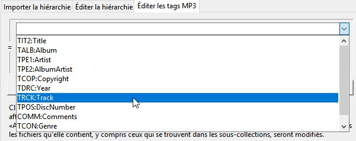

========
Utilisation
========

De la ligne de commande::

    Usage: python3 Pub2SDwizard.py
    
À partir du bureau (Windows 64 bits binaire), double-cliquez sur l'icône Pub2SDwizard.

.. image:: images/mainc.png
   :width: 57
   :alt: Pub2SDwizard icon

Quelle langue d'interface?
------------------------------
Votre premier choix est la langue d'interface avec laquelle vous souhaitez travailler (par défaut, c'est l'anglais). La
 langue de l'interface gui peut être sélectionnée dans la liste 
déroulante en haut à droite de l'écran et peut être modifiée à tout 
moment.
.. image:: images/gui_lang_fr.jpg
   :width: 274
   :alt: liste déroulante des langues d'interface gui

Suivant Pub2SDwizard commence par poser trois questions:

Le nom de votre projet?
------------------------------------

Cela peut être saisi directement ou choisi dans la liste déroulante. Les
 paramètres du projet peuvent être sauvegardés à tout moment et seront 
conservés dans un fichier '&lt;project name&gt; .prj' enregistré dans un
 dossier 'Pub2SD' sous votre dossier de base (p.ex. 'C:\Users\&lt;username&gt;\Pub2SD' pour Windows ou '~/Pub2SD' sur Linux). Ce nom sera également utilisé comme le nom du dossier de niveau supérieur sur la carte SD qui tiendra vos fichiers publiés.

Le type de votre projet?
-----------------------------

Le type de projet peut être modifié ultérieurement. Si
 vous commencez par un projet «Avancé» et que vous souhaitez ensuite le 
convertir en un projet «Simple», tout les tags qui ne sont 
disponibles que dans le mode «Avancé» seront supprimés et leurs donnés
 seront perdues.

Un projet simple vous 
permettra uniquement d'utiliser des tags qui peuvent être présentés 
sous forme de chaînes simples et vous restreignent à une seule œuvre et à
 un seul commentaire dont la langue n'est pas définie.

Un
 certain nombre de tags « avancés » vous permettent d'avoir 
plusieurs entrées pour chaque tag disputé par leurs champs 'langue' et 
'desciption'. En outre, il existe de nombreux types d'œuvres d'art qui peuvent être 
inclus. Bien que toutes les applications ne reconnaissent pas ces fonctionnalités.

Le type de projet peut être modifié ultérieurement. Mais changer votre type de 
projet de «Avancé» à «Simple» entraînera la perte de toutes les données de tags «avancés». 
Pour toutes les tags contenant plusieurs entrées, seule la première entrée sera conservée.

Une fois que 
vous avez choisi le nom de votre projet et sélectionnez votre type de 
projet, vous pouvez cliquer sur le bouton « Prochain ». Cela mettra à 
jour les champs 'Projet en cours:' et 'Mode:' près du haut de la fenêtre. 
Toutefois, vous voudrez peut-être sélectionner certains éléments supplémentaires 
dans la section « Optionnel » en premier.

Des extras optionnels?
----------------------------------

.. image:: images/Optional_fr.jpg
   :width: 620

Ces fonctionnalités peuvent être ignorées si vous êtes heureux d'accepter les paramètres par défaut.

*Quel modèle?*

.. image:: images/ChooseTemplate_fr.jpg
   :width: 593

Lorsque
 vous exécutez pour la première fois le programme, il n'y aura pas de 
modèles listés et vous pourrez donc ignorer ce choix et recevoir un jeu 
de tags par défaut présélectionné pour vous. Plus
 tard, une fois que vous avez créé un ou plusieurs modèles, vous pourrez
 sélectionner celui que vous souhaitez joindre à ce projet. Sur
 les nouveaux projets, cela déterminera quels tags seront 
affichés comme pré-sélectionnés dans l'onglet "Choisir les tags 
MP3". Cependant,
 avec un projet existant, tout les nouveaux tags spécifiés par
 le modèle seront ajoutés à la liste des tags sélectionnés pour la 
modification et l'affichage. Cela ne supprimera jamais les tags déjà présentes dans le projet.

Une fois que vous avez créé certains modèles, vous pouvez modifier 
manuellement les fichiers de modèle '.json', dans votre dossier '\ 
Documents \ Pub2SD', pour ajouter des "valeurs par défaut" à certaines 
ou à touts les tags indiqués par leurs codes de marque de quatre
 caractères. Ensuite,
 chaque fois qu'un fichier MP3 est chargé dans un projet auquel ce 
modèle est attaché, ces valeurs par défaut seront préchargés dans 
Pub2SDwizard pour tout les tags vierges. Aucune donnée de tags existante ne sera écrasé par ce mécanisme.

*Quel prefix?*

Pub2SDwizard générera des
 noms uniques pour chaque collection et fichier MP3 qui sera combiné 
avec leur nom de fichier / titre pour s'assurer qu'ils peuvent être 
référencés sans ambiguïté. Vous pouvez spécifier un préfixe qui sera ajouté au début de tous les noms uniques générés pour les fichiers et les collections. Ce
 préfixe ne sera pas vérifié par Pub2SDwizard, assurez-vous que ses 
caractères sont acceptables dans les noms de fichiers pour les 
périphériques prévus et gardez le court.

Choisissiez des tags MP3
-------------------------------------

Sur les nouveaux
 projets, les tags spécifiés par votre modèle ou dans son 
absence, les tags les plus couramment utilisés sont sélectionnés
 par défaut. Dans les projets existants, les tags déjà choisies avec tout les nouveaux tags spécifiés 
dans votre modèle sont sélectionnés par défaut. Vous pouvez ajouter ou supprimer des tags de la sélection avec un 'Ctrl + clic' sur le tag d'intérêt. Vous
 pouvez restaurer une sélection par défaut des tags les plus 
couramment utilisés en cliquant sur le bouton 'Tags par défaut'.

Notez que seules les tags sélectionnés
seront modifiés ou présentés dans les fichiers MP3 finaux.
(N.B. Les tags avec des valeurs vierges ne seront pas appliqués.)

Si vous chargez un projet existant, vous pouvez ajouter et supprimer 
des tags à ce stade. Le contenu de toutes les tags supprimées sera jeté. 
Toutes les nouveaux tags seront vierges.

Vous pouvez 
créer un nouveau modèle contenant les tags actuellement sélectionnés
 en cliquant sur le bouton "Enregistrer le modèle" et en fournissant un 
nom descriptif lorsqu'il est demandé.

Cliquez sur le bouton 'Prochain' pour continuer.

Caractères spéciaux
------------------------------

Par défaut, les tags qui requièrent 'Latin1' et les noms de fichiers générés sont 
normalisés de manière agressive pour supprimer tous les caractères 
spéciaux pour garantir la compatibilité. Vous pouvez l'annuler en spécifiant les 
préférences que vous avez. Vos préférences seront sauvegardées dans le projet, 
mais elles auront uniquement effet si l'option «Préféré: ...» est choisie. Vous pouvez 
également enregistrer vos préférences en tant que fichier texte séparé comme 
exemples pour d'autres projets. Un 
exemple de 'Latin1' (qui permettrait certains caractères acentiels etc 
... et toujours compatible avec la plupart des périphériques) est 
toujours disponible dans la liste déroulante. D'autres exemples seront 
ajoutés à cette liste car vous les enregistrez.

En cliquant sur la ligne vierge dans la liste déroulante, la liste des préférences 
sera effacée. En cliquant sur 'Latin1' ou tout autre exemple que vous avez 
enregistré, vous les ajouterez à votre liste de préférences.

Pour
 obtenir l'ensemble de base 'Latin1', sélectionnez 'Préféré' dans 
l'onglet "Caractères spéciaux" et sélectionnez 'Latin1' dans la liste 
déroulante à droite. Vous
 devriez maintenant voir une liste de paires de caractères, dans ce cas,
 dire à Pub2SDwizard de les conserver puisque les deux membres de chaque
 paire sont identiques. Si vous vouliez remplacer say '~' par '-' plutôt que 
le trait de soulignement, vous ajouteriez ', ~/-' à la fin de la liste. Vous
 pouvez même remplacer ce qui arrive aux espaces ou aux virgules en 
utilisant la notation 0xNNNN pour leurs valeurs Unicode. Ainsi, 
0x0020 / 0x0020 conserverait les espaces, tandis que 0x0027 / 0xA78C 
remplacerait l'apostrophe par le minuscule casier. 
(Bien que je ne sachiez pas combien de téléphones l'afficheraient effectivement!).

La liste préférée est strictement un ensemble de paires de chaînes plutôt 
que de caractères, donc '&#330;/Ng', 'ng/&#331;' ou même 'Tom / Fred' 
fonctionnerait. Les
 caractères dans les chaînes de chaque côté du '/' peuvent être saisis 
directement ou comme valeurs Unicode en utilisant la notation 0xNNNN.

Éditer...
-------------

.. image:: images/Edit_fr.jpg
   :width: 1012

Le projet sera affiché comme la collection de niveau supérieur, cela ne peut pas être déplacé ou supprimé.

*Importer la hiérarchie*

Dans le mode «Simple», seul le bouton «Importer un dossier et son contenu» est activé. Cela sélectionnera le dossier que vous spécifiez et créez une collection du même nom. Ensuite,
 il importera tous les fichiers MP3 de ce dossier dans la collection, en
 créant des sous-collections pour tous les sous-dossiers et en important
 leurs fichiers. Seuls les fichiers MP3 et les sous-dossiers seront importés, tous les autres fichiers seront ignorés.

Bien
 que votre projet reflète normalement la structure du dossier contenant 
vos fichiers MP3 source, le mode 'Avancé' vous permet d'ajouter des 
collections et des fichiers arbitrairement. Notez 
si vous souhaitez ajouter un fichier, vous devez d'abord sélectionner la
 ligne contenant la collection à laquelle vous souhaitez l'ajouter.

Le
 logiciel tentera d'énumérer les collections et les fichiers dans un 
ordre logique, MAIS, vous devez toujours vérifier que l'ordre dans 
lequel les fichiers sont affichés est l'ordre dans lequel vous souhaitez
 qu'ils soient joués, en l'ajustant au besoin. Notez que le titre de 
toutes les collections sera basé sur le nom du dossier dérivé, plutôt 
que sur l'étiquette de titre dans un fichier MP3. Ainsi,
 tous les compromis faits dans la représentation de l'orthographe pour 
le système d'exploitation d'origine seront préservés. Par
 conséquent, vous devez toujours vérifier que les titres des collections
 sont comme vous le souhaitez pour apparaître (par exemple, Saa+ï doit
 être remplacé soit par Saang ou Saaŋ). 

Une fois que vous avez 
importé les fichiers et disposé dans l'ordre que vous souhaitez, vous 
êtes recommandé de sauvegarder le projet. Lors du redémarrage du 
programme et de la sélection du projet, tous vos paramètres et hiérarchie 
existants seront restaurés. Des fichiers supplémentaires peuvent être ajoutés au projet.

Couper du titre

Sur la base des 
fichiers de commande affichés, Pub2SDwizard crée et conserve des noms 
uniques pour chaque fichier et les utilise lorsque les fichiers sont 
publiés avec le titre MP3 (ou le nom de fichier original) ajouté. Les
 dossiers individuels ont souvent eu des caractères avant ou arrière 
ajoutés à leurs noms de fichiers (et / ou leurs titres MP3) afin de 
déterminer l'ordre dans lequel ils doivent être lus. Ceux-ci peuvent ne 
plus être requis et peuvent donc être supprimés à l'aide du bouton 'Couper du titre'. Cela
 montrera également, dans la colonne la plus à gauche, le dossier final 
et les noms de fichier qui seront publiés sur la carte SD.

Cela réduira les caractères de chaque élément en dessous de la collection actuellement 
sélectionnée.Il faut prendre soin, si aucune collection n'est sélectionnée, l'action sera appliquée à TOUS. 
En cas d'erreurs, il est souvent plus rapide d'abandonner un projet et de 
recommencer (chargement de votre copie sauvegardée du projet) plutôt que
 d'essayer de corriger chaque titre individuellement.

Une
 fois que vous avez importé tous les fichiers et vérifié l'ordre dans 
lequel ils sont affichés et trié les caractères indésirables, cliquez 
sur le bouton 'Prochain'.

*Éditer la hiérarchie*

Le mode 'Simple' vous permettra uniquement de supprimer des fichiers 
ou des collections indésirables. Le mode 'Avancé' vous permet également 
de restructurer votre hiérarchie.

Sélectionnez les lignes nécessaires pour supprimer des éléments ou modifier 
leur position dans la hiérarchie. Lorsque
 vous importez un dossier, seuls les fichiers MP3 seront répertoriés, 
mais tous les sous-dossiers seront affichés en tant que collections 
qu'ils contiennent des fichiers MP3 ou non.

Une
 fois que toutes les collections parasites ont été supprimées et que la 
hiérarchie est réglée comme vous le souhaitez, cliquez sur le bouton 
'Prochain'.

*Éditer les tags MP3*

En interne, tout le texte se 
déroule sous la forme de chaînes unicode et sera écrit sur les tags MP3 
dans les fichiers finaux dans l'encodage 'utf-8'. Les tags qui 
nécessitent un codage 'Latin1' seront automatiquement imposées à un 
sous-ensemble '7-ASCII' de 'utf-8', ou vos caractères préférés. Ainsi, alors que les titres (TIT2) 
seront tenus et écrits en caractères unicode, lorsque Pub2SDwizard crée
 le nom de fichier qui sera écrit sur les cartes SD, tous les caractères
 seront réduits à leurs formes de base, les diacritiques supprimés, les 
ligatures divisées et une translittération approximative de tout les 
caractères cyrillique, grecs ou non-romains seront tentés. De plus, 
toute ponctuation ou espace deviendra des chars de soulignement, ou vos caractères préférés.

(Par exemple  'à Â Þ Æ ç Ŋ ŋ ñ ƴ'  deviendrait 'a_A_Th_AE_c_NG_ng_n_y')

Dans le mode 'Simple', tout les tags seront représentées sous la forme 
de un seul chaîne de caractères et leur codage et tout autre paramètre 
sera caché. En effet, seuls les tags pouvant être traités de cette 
manière sont disponibles en mode 'Simple'.

En mode 'Avancé', les 
tags sont affichés sous forme de listes de paramètres. Le 'encodage' 
pour le texte lu à partir d'un tag MP3 sera affiché en un seul chiffre.
 Quel que soit l'encodage original, le texte sera toujours écrit dans 
'utf-8' représenté par '3'. Alors que les chaînes de texte sont 
généralement retenues comme une liste de chaînes plutôt que d'une seule 
chaîne, ce qui est affiché pour un tag donné dépend de l'application de 
lecteur MP3 utilisateur. En général, seule la première chaîne de la 
liste est susceptible d'être affichée.

Sélectionnez d'abord la 
ligne que vous souhaitez modifier. Seuls les fichiers MP3 peuvent 
contenir des tags afin que les modifications que vous appliquez à une 
collection affecteront tous les fichiers MP3 au-dessous. Sélectionnez 
maintenant un tag dans la liste déroulante.

La valeur actuelle de cet tag ou sa valeur par défaut doit être affichée 
automatiquement dans la zone de saisie. Si cela ne s'affiche pas, cliquez sur le 
bouton 'Obtenir'. Ou vous pouvez cliquer sur le bouton 'Obtenir par défaut' 
pour obtenir un modèle vide. Une fois que vous l'avez modifié, cliquez 
sur le bouton 'Appliquer' pour appliquer le tag. Si vous avez sélectionné 
une collection, cela écrasera cet tag pour 
tous les fichiers MP3 ci-dessous.

Dans le mode 'Avancé', certaines tags vous permettent d'avoir plusieurs images dans une tag. 
(Par exemple, vous voudrez peut-être ajouter des commentaires en français et en anglais 
à le tag COMM ou aux couvertures avant et arrière à le tag APIC). 
Quels champs dans la cadre du tag (un ensemble 
de paramètres pour cet tag) sont utilisés pour identifier les cadres discrètes est 
décrit dans le tag ci-dessous la zone de saisie. Utilisez le bouton 'Obtenir par défaut' 
pour obtenir un modèle vide. Lorsque vous cliquez sur le bouton 'Appliquer' si 
le nouveau cadre est unique dans le tag, il sera ajouté au tag. Sinon, il remplacera 
l'une des images existantes. Les multiples images seront affichées sous la forme d'une 
liste séparée par le '|' carater. Si vous éditez la liste des images directement en cliquant sur le bouton 
'Appliquer', écraseront toutes les images existantes dans le tag.

'℗'

Lorsque 
l'application utilisateur lecteur MP3 affiche le contenu de le tag 
Copyright (TCOP), elle sera toujours précédée du symbole de copyright 
'©'. Ceci est spécifié dans les normes ID3 et ne peut pas être modifié. Si
 vous préférez utiliser le symbole de copyright de l'enregistrement 
sonore '℗', vous devrez l'ajouter au début de la chaîne de copyright. 
Bien que cela entraîne l'affichage des deux symboles précédant le reste de la chaîne 
('© ℗'). Alternativement,
 le tag Commentaire (COMM) pourrait être utilisée, mais soyez 
conscient que l'application des lecteurs MP3 utilisateurs peut ne pas 
afficher le tag Commentaire.

Sélectionnez l'art de couverture

Dans le mode 'Simple', le tag de couverture (APIC) ne peut être
modifiée que via le bouton 'Sélectionner une œuvre de couverture'.

Le tag de couverture (APIC) contient toutes les images incorporées dans le fichier MP3. 
Pour sauvegarder l'espace de l'écran, toute donnée d'image intégrée est remplacée par 
le support de place  b'{}', où {} est la taille du graphique intégré dans kilo-octets. 
Étant donné que les données d'image dépassent 128 octets, même pour les 
petits fichiers png, il est plus facile d'ajouter des illustrations à 
l'aide du bouton «Sélectionner une œuvre de couverture». Vous pouvez spécifier 
la nature de l'illustration dans la liste déroulante ci-dessous.

Dans le mode 'Simple', seul le type d'image 'COVER_FRONT' est autorisé et toute description sera ignorée.

Une fois que vous avez ajouté un fichier image, l'emplacement source sera 
affiché en tant que chaîne plutôt qu'un détenteur de place.

Dans le mode 'Avancé', plusieurs images peuvent être attachées chacune avec 
leurs propres paramètres affichés comme '|' liste séparée. Vous pouvez ajouter 
une brève description ci-dessous. Cette description sert à distinguer plusieurs 
ensembles de paramètres ajoutés à le tag APIC. Mais une seule icône de fichier 
peut être ajoutée à un tag APIC avec le type d'image 'FILE ICON' ou 'OTHER FILE ICON'.

*Comportements spéciaux*

En
 général, essayer de définir un tag sur une collection appliquera
 simplement cet tag à tous les fichiers MP3 au-dessous. 
Cependant, certaines tags ont des comportements «spéciaux» lorsqu'une collection est sélectionnée:

**TRCK:** Ce peut être simplement un numéro de piste '4' ou une piste dans un ensemble '4/20'. La
 spécification d'un numéro de piste de zéro entraînera que toutes les 
pistes au-dessous de la collection soient numérotées séquentiellement à 
partir de '1'. La spécification d'un numéro de piste réel entraînera tous ceux qui ont le même numéro de piste. 
De même, si la piste "0/0" du format défini est utilisée, tous les 
fichiers situés sous cette collection seront comptés et répertoriés 
comme «suivi / nombre total de fichiers». Encore une fois, si une valeur autre que zéro pour la partie 'de set' 
est entrée (par ex. '0/100'), la même valeur 'du set' sera appliquée à 
tous les fichiers situés sous cette collection.

**TSOA, TSOC, TSOP, TSO2:** 
ces tags sont parfois utilisées pour spécifier les
 ordres de tri et peut prévaloir sur la séquence dans laquelle les fichiers seront lus. La
 définition de ces tags sur une collection entraînera tous les 
fichiers ci-dessous, les tags étant définies sur le nom unique 
que Pub2SDwizard généré pour chaque fichier.

Une fois que vous êtes satisfait du contenu des tags, cliquez sur le bouton 'Prochain'. 
Cela vous amènera à l'onglet 'Options de téléphones fonctionnels.

Options de téléphones fonctionnels
-----------------------------------------------------

 .. image:: images/FeaturePhone_fr.jpg
  :width: 598

Les 'Playlists' générées par Pub2SDwizard peuvent être copiées soit au 
niveau supérieur de la carte SD, soit sous les noms de dossier que vous 
avez spécifiés.

Notez que les 
'Playlists' (« listes de lecture ») peuvent être créées dans le format «Legacy» 
(fichiers «.M3U» à l'aide de polices pré-Unicode) ou « UTF-8 » (fichiers 
« .M3U8 » à l'aide de polices Unicode). Bien que 
« .M3U8 » soit la norme pour les téléphones modernes, de nombreuses 
applications et téléphones plus anciens ne supportent que « .M3U ». Si
 vous devez prendre en charge les deux, choisissez "Les deux", ce qui 
générera les 'PlayLists' dans les deux formats, avec seulement un petit 
espace aérien utilisé.

Maintenant, nous pouvons cliquer sur le bouton 'Préparer les fichiers'. Cela
 crée un dossier temporaire et permet de réaliser des copies de travail 
de tous vos fichiers MP3 et applique les modifications apportées à leurs
 tags. Cela peut prendre du temps, mais vous 
devriez voir une barre de progression et une ligne d'état en bas de la 
fenêtre montrant à quel point elle est arrivée.

Sortie à ...
-----------------

Enfin, la 'Sortie à ...' onglet apparaît.

Vous pouvez soit
 "Publier à SD/USB" pour publier sur un lecteur flash SD ou USB, 
ou 'Publier à '~\Pub2SD\`<project>`_SD' pour 
publier sur le dossier par défaut sur votre disque dur. Ce dossier 
sera créé pour vous s'il n'existe pas déjà, mais si cela se 
produit, toutes les données précédentes dans ce dossier seront effacées.

**N.B.** Seuls les 8 premiers lecteurs amovibles trouvés seront répertoriés ici. Assurez-vous
 que toutes les cartes SD ou les lecteurs USB que vous souhaitez 
afficher sont insérées, disposent d'un espace libre suffisant et aucun 
nom de dossier n'est en conflit avec le nom de votre projet. Pour une meilleure 
performance, assurez-vous qu'ils sont connectés à un port USB3 via un concentrateur USB3 si nécessaire. Si
 vous avez plusieurs lecteurs de carte USB-SD connectés, utilisez un 
mélange de différentes marques pour éviter de confondre le logiciel. 
Sachez que Windows10 peut ne pas reconnaître le pilote du lecteur de carte 
SD intégré d'un ordinateur portable.

Cliquez sur le bouton 'Actualiser' pour vous assurer que la liste des lecteurs 
amovibles est à jour. Ensuite, cliquez sur la case à cocher de chacune des unités SD / USB que vous souhaitez publier.

Après avoir vérifié que seuls les lecteurs que vous souhaitez publier sont sélectionnés, cliquez sur le bouton.

Cela va générer et afficher la liste des lecteurs pour la publication et 
confirmer qu'ils sont tous encore connectés et disposent d'espace libre 
suffisant.

Enfin, cliquez sur le bouton en haut. La barre de progression continuera à traverser pendant que le logiciel écrira sur les lecteurs. Le
 nombre de lecteurs actuellement en cours d'écriture est affiché 
ci-dessous, avec un message rempli une fois que l'écriture de tous les 
lecteurs a terminé.

.. image:: images/PublishToHdButton.jpg
   :width: 278

Si vous 
préférez, vous pouvez publier sur votre disque dur en cliquant sur le 
bouton en haut, puis copier ensuite du dossier « ~ \ Pub2SD \ 
`<project`> _SD » à un autre emplacement, au besoin.<

Lorsque vous 
cliquez sur l'un des boutons "Publier ...", tous les nouveaux fichiers 
seront créés avec tous les dossiers nécessaires, toutes les données 
copiées à partir des fichiers de travail et enfin les nouveaux fichiers 
seront tous fermés. Cela garantit qu'ils ont tous les mêmes dates de "création" et "dernière modification".

Bien qu'il soit 
possible de se déplacer vers l'arrière et vers l'avant à travers les 
onglets en changeant votre projet, les résultats sont plus prévisibles 
si vous ne faites que chaque étape en séquence. Vous pouvez enregistrer les paramètres 
du projet à tout moment et vous proposera la possibilité de modifier le nom du projet. Lorsque
 vous redémarrez Pub2SDwizard et sélectionnez un projet existant, tous 
vos travaux précédents devraient être chargés pour vous et vous pouvez 
continuer à partir de là.

Nous nous félicitons de tout commentaire et nous nous efforcerons de corriger les 
bugs tels qu'ils sont trouvés. Cependant, «Erreurs et omissions sont attendues», 
laissez l'utilisateur se méfier! Encore une fois, sachez que les applications et le matériel individuels ont 
peut-être implémenté le standard ID3 différemment et diffèrent selon 
leur utilisation habituelle. Toujours tester sur l'application et le matériel pertinents, 
aucune garantie n'est donnée ou implicite!

